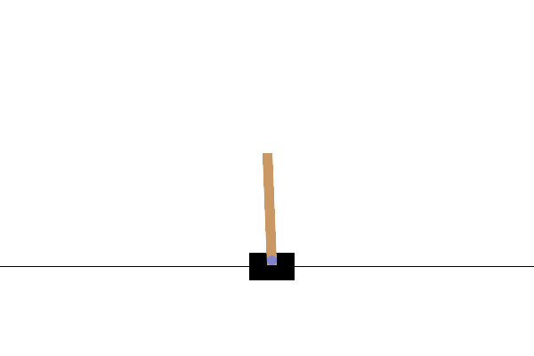
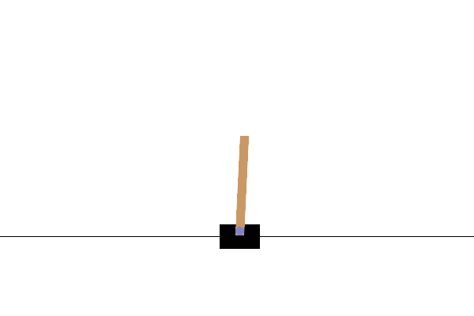
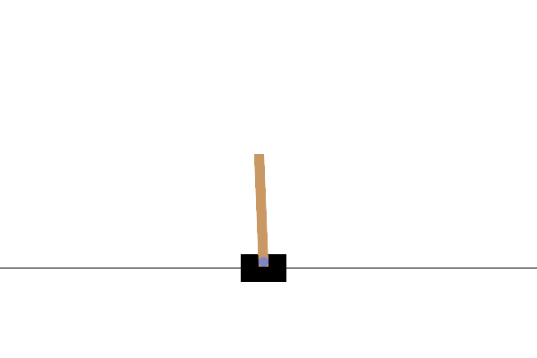
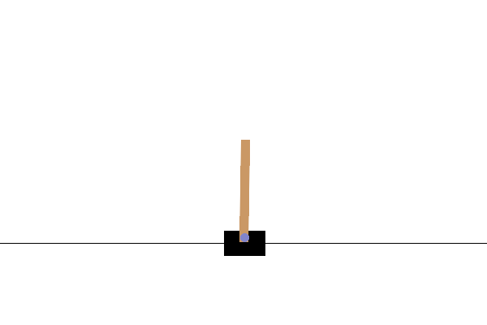
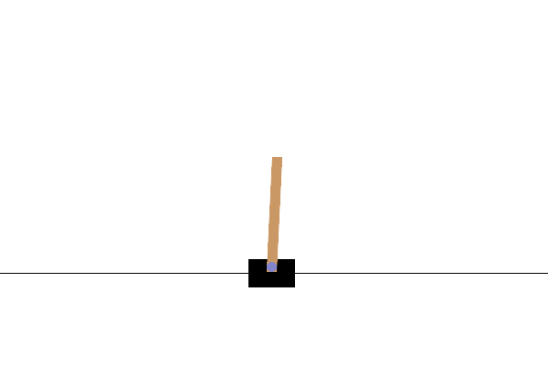

# 动手学强化学习

gymnasium==0.29.1

## Chapter 7 DQN Algorithm



### blogs

[https://zhuanlan.zhihu.com/p/656515516 动手学强化学习reinforcement learning-chapter-seven-DQN algorithm，阅读的笔记](https://zhuanlan.zhihu.com/p/656515516)

### Numpy implementation of Chapter 7 DQN Algorithm
**difference**: `self.epsilon = self.epsilon * 0.996 if self.epsilon > 0.0001 else 0.0001`, `network with numpy` and so on.

**run**
```
python ./numpy_RL_reinforcement_learning/chapter7_DQN.py
python ./chapter7.py
```


## Chapter 8 DQN改进以后的算法


### blogs

[https://zhuanlan.zhihu.com/p/656614302 动手学强化学习reinforcement learning-chapter-eight-DQN改进 algorithm，阅读的笔记](https://zhuanlan.zhihu.com/p/656614302)

### Numpy implementation of Chapter 8 DQN improvement Algorithm

**run**
```
python ./numpy_RL_reinforcement_learning/chapter8.py
python ./chapter8.py
```


## Chapter 9 策略梯度算法



### blogs

[https://zhuanlan.zhihu.com/p/656835865 动手学强化学习reinforcement learning-chapter-nine-策略梯度算法，阅读的笔记](https://zhuanlan.zhihu.com/p/656835865)

### Numpy implementation of Chapter 9 策略梯度算法
**difference**: `self.epsilon = self.epsilon * 0.996 if self.epsilon > 0.0001 else 0.0001`, `network with numpy` and so on.

**run**
```
python ./numpy_RL_reinforcement_learning/chapter9_策略梯度算法.py
python ./chapter9.py
```


## Chapter 10 Actor-Critic 算法


### blogs

[https://zhuanlan.zhihu.com/p/657087227 动手学强化学习reinforcement learning-chapter-ten-Actor-Critic algorithm，阅读的笔记](https://zhuanlan.zhihu.com/p/657087227)

### Numpy implementation of Chapter 10 Actor-Critic 算法

**run**
```
python ./numpy_RL_reinforcement_learning/chapter10_Actor-Critic算法.py
python ./chapter10.py
```


## Chapter 11 TRPO算法

 

### blogs

[https://zhuanlan.zhihu.com/p/657548225 动手学强化学习reinforcement learning-chapter-eleven-TRPO algorithm，阅读的笔记](https://zhuanlan.zhihu.com/p/657548225)

## Chapter 12 PPO算法

 

### blogs

[https://zhuanlan.zhihu.com/p/658299943 动手学强化学习reinforcement learning-chapter-twelve-PPO algorithm，阅读的笔记](https://zhuanlan.zhihu.com/p/658299943)

### Numpy implementation of Chapter 12 PPO算法

**run**
```
python ./numpy_RL_reinforcement_learning/chapter12.py
python ./chapter12.py
```


## Chapter 13 DDPG算法


### blogs

[https://zhuanlan.zhihu.com/p/658460643 动手学强化学习reinforcement learning-chapter-thirteen-DDPG 算法，阅读的笔记](https://zhuanlan.zhihu.com/p/658460643)

### Numpy implementation of Chapter 13 DDPG算法

**run**
```
python ./numpy_RL_reinforcement_learning/chapter13.py
python ./chapter13.py
```


## Chapter 1four SAC算法

&&&&&&&

### blogs

[https://zhuanlan.zhihu.com/p/658560149 动手学强化学习reinforcement learning-chapter-fourteen-SAC algorithm，阅读的笔记](https://zhuanlan.zhihu.com/p/658560149)

-------------------------------------original readme---------------------------------

-------------------------------------original readme---------------------------------

-------------------------------------original readme---------------------------------

Tips: 若运行gym环境的代码时遇到报错，请尝试pip install gym==0.18.3安装此版本的gym库，若仍有问题，欢迎提交issue！

欢迎来到《动手学强化学习》（Hands-on Reinforcement Learning）的地带。该系列从强化学习的定义等基础讲起，一步步由浅入深，介绍目前一些主流的强化学习算法。每一章内容都是一个Jupyter Notebook，内含详细的图文介绍和代码讲解。

* 由于GitHub上渲染notebook效果有限，我们推荐读者前往[Hands-on RL主页](https://hrl.boyuai.com/)进行浏览，我们在此提供了纯代码版本的notebook，供大家下载运行。

* 欢迎在[京东](https://item.jd.com/13129509.html)和[当当网](http://product.dangdang.com/29391150.html)购买《动手学强化学习》。

* 如果你发现了本书的任何问题，或者有任何改善建议的，欢迎提交issue！

* 本书配套的强化学习课程已上线到[伯禹学习平台](https://www.boyuai.com/elites/course/xVqhU42F5IDky94x)，所有人都可以免费学习和讨论。


